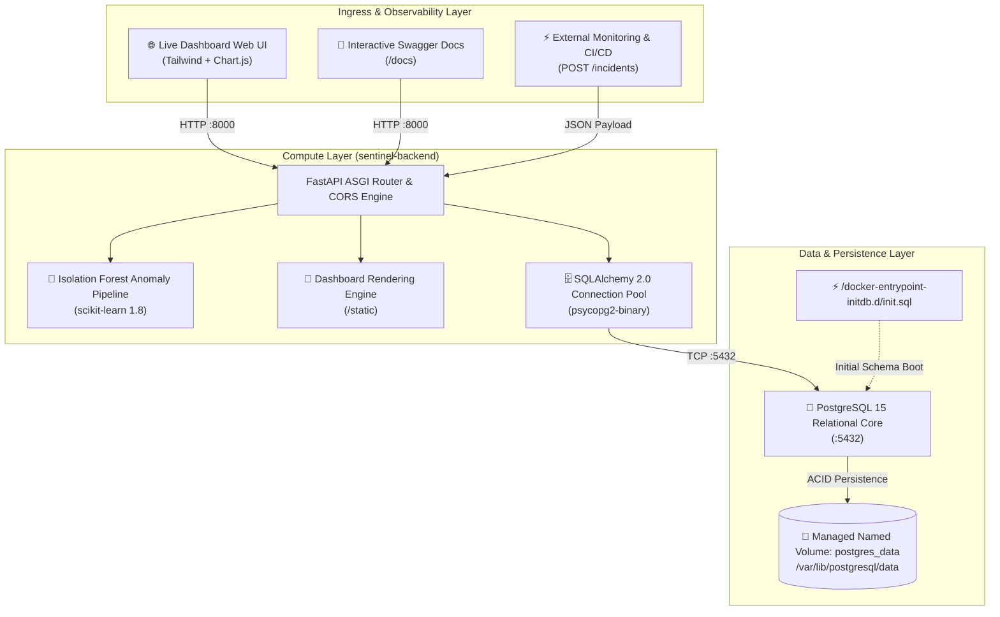

<div align="center">

```
███████╗███████╗███╗   ██╗████████╗██╗███╗   ██╗███████╗██╗      █████╗ ██╗
██╔════╝██╔════╝████╗  ██║╚══██╔══╝██║████╗  ██║██╔════╝██║     ██╔══██╗██║
███████╗█████╗  ██╔██╗ ██║   ██║   ██║██╔██╗ ██║█████╗  ██║     ███████║██║
╚════██║██╔══╝  ██║╚██╗██║   ██║   ██║██║╚██╗██║██╔══╝  ██║     ██╔══██║██║
███████║███████╗██║ ╚████║   ██║   ██║██║ ╚████║███████╗███████╗██║  ██║██║
╚══════╝╚══════╝╚═╝  ╚═══╝   ╚═╝   ╚═╝╚═╝  ╚═══╝╚══════╝╚══════╝╚═╝  ╚═╝╚═╝
```

### **Autonomous DevOps Incident Intelligence & Telemetry Anomaly Detection Platform**

[](https://sentinel-ai-containerized-dev-ops-i.vercel.app/)
[](https://sentinel-ai-containerized-dev-ops-i.vercel.app/docs)
[](https://www.docker.com/)
[](https://docs.docker.com/compose/)
[](https://fastapi.tiangolo.com/)
[](https://www.postgresql.org/)
[](https://scikit-learn.org/)
[](https://opensource.org/licenses/MIT)

<br/>

**[🌐 Live Dashboard](https://sentinel-ai-containerized-dev-ops-i.vercel.app/)** •
**[📖 Interactive API Docs](https://sentinel-ai-containerized-dev-ops-i.vercel.app/docs)** •
**[🧠 AI Risk Analysis Endpoint](https://sentinel-ai-containerized-dev-ops-i.vercel.app/ai/risk-analysis)** •
**[🏗️ Architecture](#-system-architecture)** •
**[🌐 Networking Guide](#-networking--macvlan--ipvlan-deep-dive)**

</div>

---

## 🌟 Executive Overview

**SentinelAI** is an enterprise-grade, containerized DevOps incident intelligence and telemetry analysis system. In distributed modern cloud environments, Site Reliability Engineering (SRE) teams receive massive volumes of infrastructure alerts — database connection timeouts, microservice latency degradations, container crash-loops, and gateway outages. 

Without automated intelligence, distinguishing true statistical anomalies from normal operational noise is challenging, inflating **Mean Time to Detection (MTTD)** and **Mean Time to Resolution (MTTR)**.

SentinelAI solves this by providing:
* **High-Throughput Ingestion**: Direct ACID parameterized persistence in PostgreSQL 15.
* **Unsupervised Anomaly Scoring**: Real-time **Isolation Forest** machine learning to detect downtime duration outliers without requiring labeled historical ground truth.
* **Cyberpunk DevOps Dashboard**: Single-page dark glassmorphic web UI with live multi-chart metrics, microservice reliability scorecards, regional heatmaps, and a chaos simulator.
* **Production-Grade Containerization**: Multi-stage container builds, non-root least privilege user execution, persistent named volumes, healthcheck readiness probes, and advanced Macvlan/Ipvlan LAN network routing.

---

## 🚀 Live Production Deployments

| Component | Provider | Live URL | Status |
| :--- | :--- | :--- | :--- |
| **Observability Dashboard** | Vercel Edge Global CDN | [https://sentinel-ai-containerized-dev-ops-i.vercel.app/](https://sentinel-ai-containerized-dev-ops-i.vercel.app/) |  |
| **OpenAPI / Swagger UI** | Vercel Serverless Python | [https://sentinel-ai-containerized-dev-ops-i.vercel.app/docs](https://sentinel-ai-containerized-dev-ops-i.vercel.app/docs) |  |
| **AI Anomaly Inference** | Scikit-Learn Engine | [https://sentinel-ai-containerized-dev-ops-i.vercel.app/ai/risk-analysis](https://sentinel-ai-containerized-dev-ops-i.vercel.app/ai/risk-analysis) |  |
| **Managed Cloud DB** | Neon Serverless PostgreSQL | `aws-us-east-2 (Ohio)` |  |

---

## 🖥️ Modern Web UI Dashboard

SentinelAI features an interactive, dark-mode observability dashboard powered by **Tailwind CSS**, **Lucide Icons**, and **Chart.js**:

```
┌────────────────────────────────────────────────────────────────────────────────┐
│  [🛡️ SentinelAI] Enterprise v2.4   [Simulate Outage] [Seed Telemetry] [Log Inc] │
├────────────────────────────────────────────────────────────────────────────────┤
│  [backend: Online]  [sentinel-db: Active]  [ML Engine: Ready]  [Volume: Durable]│
├────────────────────────────────────────────────────────────────────────────────┤
│  [Total Events]  [MTTR/Avg]  [AI Outliers]  [Critical]  [Global SLA]  [Regions]│
├──────────────────────────────────────────────────────┬─────────────────────────┤
│  📈 Downtime Timeline & Anomaly Boundary            │ 🍩 Severity Breakdown   │
│     (Interactive Bar & Spline Curve Switcher)        │ 🧠 AI Diagnostics Card  │
├──────────────────────────────────────────────────────┼─────────────────────────┤
│  🛡️ Microservice Reliability Scorecard (SLA Gauge)   │ 🗺️ Regional Heatmap     │
│     (Uptime % per service: payment, auth, billing)   │    (Cloud Outage Zones) │
├──────────────────────────────────────────────────────┴─────────────────────────┤
│  📊 Live Telemetry Ledger (Search, Multi-Filter, Anomaly Badges, Export to CSV)│
└────────────────────────────────────────────────────────────────────────────────┘
```

### Key UI Capabilities:
* **Interactive Timeline**: Real-time incident durations with AI-flagged anomaly bars glowing in pulsing red/rose. Switchable between **Bar Mode** and **Spline Curve Mode**.
* **Microservice Reliability Scorecard**: Real-time SLA reliability scores ($70\% - 100\%$) and total downtime tracking per microservice (`payment-gateway`, `auth-service`, `database-cluster`).
* **Regional Cloud Heatmap**: Categorized bar breakdown of outages across global AWS/GCP/Azure cloud zones.
* **Chaos / Outage Simulator**: Injects synthetic high-severity outage events to test real-time ML anomaly detection.
* **Incident Ledger & CSV Export**: Searchable data table with severity badges and 1-click export for incident postmortems.

---

## 🏛️ System Architecture



---

## 🔬 AI Anomaly Detection Engine

### Algorithm: Isolation Forest
SentinelAI utilizes **Isolation Forest**, an unsupervised tree ensemble algorithm built on the premise that **anomalous observations are few and structurally distinct**, making them significantly easier to isolate than nominal data points.

```
       [Root Dataset: All Downtimes]
              /             \
       [Downtime <= 12]    [Downtime > 12] ─── (Isolated in 1 Split! -> ANOMALY 🚨)
          /        \
    [Downtime<=6] [Downtime>6]
       /    \       /     \
     ...   ...    ...    ...  ─── (Requires many recursive splits -> NOMINAL ✓)
```

### Mathematical Formulation
1. An ensemble of randomized Isolation Trees (iTrees) is constructed.
2. Given a feature vector $x$ (downtime duration) and subsample size $n$, the path length $h(x)$ is the number of edges $x$ traverses from the root node to a terminating leaf node.
3. The average path length $E(h(x))$ across all trees is normalized against the average path length of an unsuccessful search in a Binary Search Tree:
   $$c(n) = 2 \ln(n - 1) + 0.5772156649 \text{ (Euler-Mascheroni Constant)} - \frac{2(n - 1)}{n}$$
4. The composite anomaly score $s(x, n)$ is defined as:
   $$s(x, n) = 2^{-\frac{E(h(x))}{c(n)}}$$
   * If $s \to 1.0$: Short average tree path $\rightarrow$ **High confidence anomaly**.
   * If $s < 0.5$: Deep average tree path $\rightarrow$ **Nominal baseline event**.

### Backend Python Engine (`backend/app.py`)
```python
@app.get("/ai/risk-analysis")
def risk_analysis():
    with engine.connect() as conn:
        result = conn.execute(text("SELECT downtime_minutes FROM incidents"))
        values = [r[0] for r in result]

    if len(values) < 5:
        return {"message": "not enough incidents"}

    # contamination=0.20 defines expected 20% statistical outlier distribution
    model = IsolationForest(contamination=0.2, random_state=42)
    model.fit([[v] for v in values])

    preds = model.predict([[v] for v in values])
    anomalies = [values[i] for i, p in enumerate(preds) if p == -1]

    return {"anomalous_downtime": anomalies}
```

---

## 📦 Container Infrastructure & Docker Implementation

SentinelAI consists of two decoupled microservices orchestrated via Docker Compose:

| Property | `sentinel-backend` | `sentinel-db` |
| :--- | :--- | :--- |
| **Base Image** | `python:3.11-slim` | `postgres:15` |
| **Build Strategy** | Multi-stage build with non-root user | Custom Dockerfile with `init.sql` |
| **Security Principle** | Least Privilege (`USER appuser`) | Database container isolation |
| **Internal Port** | `8000` | `5432` |
| **Host Port Mapping** | `8000:8000` | Internal network only |
| **State Persistence** | Stateless | Managed Named Volume (`postgres_data`) |
| **Readiness Probe** | `GET /health` (HTTP 200) | `pg_isready -U postgres` |

### `docker-compose.yml`
```yaml
services:
  db:
    build: ./database
    container_name: sentinel-db
    environment:
      POSTGRES_USER: postgres
      POSTGRES_PASSWORD: password
      POSTGRES_DB: sentinel
    volumes:
      - postgres_data:/var/lib/postgresql/data
    networks:
      - sentinel-net
    healthcheck:
      test: ["CMD-SHELL", "pg_isready -U postgres"]
      interval: 10s
      timeout: 5s
      retries: 5
    restart: unless-stopped

  backend:
    build: ./backend
    container_name: sentinel-backend
    environment:
      DATABASE_URL: postgresql://postgres:password@db:5432/sentinel
    ports:
      - "8000:8000"
    depends_on:
      db:
        condition: service_healthy
    networks:
      - sentinel-net
    restart: unless-stopped

volumes:
  postgres_data:

networks:
  sentinel-net:
    driver: bridge
```

---

## 🌐 Networking — Macvlan & Ipvlan Deep Dive

Standard Docker bridge networks isolate containers behind NAT. For scenarios where containers must appear as first-class physical devices on a local LAN, SentinelAI supports **Macvlan** and **Ipvlan L2**:

```
                      Physical Network Router (192.168.1.1)
                                      │
               ┌──────────────────────┴──────────────────────┐
               │                                             │
      Host NIC (eth0)                               Physical LAN Devices
               │
    ┌──────────┴──────────┐
    │  Macvlan / Ipvlan   │
    ├─────────────────────┤
    │ sentinel-backend    │ ─── IP: 192.168.1.50 (Direct LAN Reachability)
    │ sentinel-db         │ ─── IP: 192.168.1.51 (Direct LAN Reachability)
    └─────────────────────┘
```

### Network Driver Comparison

| Driver Property | Bridge | Macvlan | Ipvlan L2 |
| :--- | :--- | :--- | :--- |
| **Subnet Addressing** | Virtual NAT (172.x.x.x) | Real LAN Subnet (192.168.1.x) | Real LAN Subnet (192.168.1.x) |
| **Container MAC** | Virtual Generated | Unique Virtual MAC per container | Shared with Host Hardware MAC |
| **Port Forwarding** | Required (`-p 8000:8000`) | Not Required (Direct IP:Port) | Not Required (Direct IP:Port) |
| **Host-to-Container**| Native | Blocked (Kernel restriction) | Allowed Natively |
| **Host Workaround** | None needed | Requires dedicated host subinterface | None needed |

### Macvlan Commands & Host Isolation Resolution (Linux)
```bash
# 1. Create external Macvlan network bound to host physical NIC (eth0)
docker network create \
  --driver macvlan \
  --subnet=192.168.1.0/24 \
  --gateway=192.168.1.1 \
  --opt parent=eth0 \
  sentinel-macvlan

# 2. Resolve Host-to-Container Isolation (Create Macvlan subinterface on host)
ip link add macvlan-host link eth0 type macvlan mode bridge
ip addr add 192.168.1.99/32 dev macvlan-host
ip link set macvlan-host up
ip route add 192.168.1.0/24 dev macvlan-host
```

---

## 📚 REST API Reference

Interactive Swagger documentation is available at [https://sentinel-ai-containerized-dev-ops-i.vercel.app/docs](https://sentinel-ai-containerized-dev-ops-i.vercel.app/docs).

### 1. `GET /`
Serves the modern single-page DevOps cyber dashboard.

### 2. `GET /health`
Liveness probe utilized by orchestrators.
```json
{ "status": "running" }
```

### 3. `POST /incidents`
Records infrastructure incident telemetry into PostgreSQL. Supports both JSON body and URL query parameters.
```json
// POST /incidents
{
  "service_name": "payment-gateway",
  "severity": "critical",
  "downtime_minutes": 65,
  "region": "ap-south-1"
}
```
**Response (200 OK):**
```json
{ "message": "incident stored" }
```

### 4. `GET /incidents`
Retrieves all recorded telemetry sorted chronologically.
```json
[
  {
    "id": 1,
    "service_name": "auth-service",
    "severity": "low",
    "downtime_minutes": 4,
    "region": "us-east-1",
    "created_at": "2026-08-30T03:50:00"
  },
  {
    "id": 2,
    "service_name": "payment-gateway",
    "severity": "critical",
    "downtime_minutes": 65,
    "region": "ap-south-1",
    "created_at": "2026-08-30T03:51:00"
  }
]
```

### 5. `GET /ai/risk-analysis`
Executes Isolation Forest anomaly detection across all recorded downtime durations.
```json
{
  "anomalous_downtime": [65]
}
```

### 6. `POST /seed`
Populates realistic multi-service demo telemetry with nominal events and anomaly outliers.

---

## 🛠️ Local Development & Quickstart

### Option A: Run via Docker Compose (Recommended)
```bash
# 1. Clone the repository
git clone https://github.com/Nitanshu715/SentinelAI-Containerized-DevOps-Incident-Intelligence-System.git
cd SentinelAI-Containerized-DevOps-Incident-Intelligence-System

# 2. Build and launch the container stack
docker compose up -d --build

# 3. Access local endpoints
# Dashboard: http://localhost:8000
# Swagger Docs: http://localhost:8000/docs
```

### Option B: Run Directly with Python (Localhost)
```bash
cd backend
python -m venv venv
source venv/bin/activate  # Or .\venv\Scripts\Activate.ps1 on Windows
pip install -r requirements.txt

# Run FastAPI server
uvicorn app:app --reload --host 0.0.0.0 --port 8000
```

---

## 📂 Project Structure

```
SentinelAI-Containerized-DevOps-Incident-Intelligence-System/
├── api/
│   └── index.py            # Vercel Serverless Function entrypoint
├── backend/
│   ├── app.py              # FastAPI server, SQLAlchemy pooling, Isolation Forest
│   ├── requirements.txt    # Pinned Python dependencies
│   ├── Dockerfile          # Multi-stage container build with non-root appuser
│   └── static/
│       └── index.html      # Modern Cyber/DevOps Glassmorphism Dashboard UI
├── database/
│   ├── Dockerfile          # Custom PostgreSQL 15 container wrapper
│   └── init.sql            # Idempotent table schema initialization
├── docker-compose.yml       # Stack orchestration, volumes, networks, healthchecks
├── vercel.json             # Vercel serverless build and routing configuration
├── render.yaml             # Render Blueprint 1-click cloud deployment config
├── requirements.txt        # Root dependencies for Vercel deployment
├── .dockerignore           # Excludes build context overhead (venv, caches)
├── .gitignore              # Git ignore configuration
├── LICENSE                 # MIT Open Source License
└── README.md               # Comprehensive project documentation
```

---

## 📜 License
This project is open-source and licensed under the terms of the [MIT License](LICENSE).

<div align="center">
<b>SentinelAI &bull; Built with ❤️ for SRE & DevOps Engineering Teams</b>
</div>
